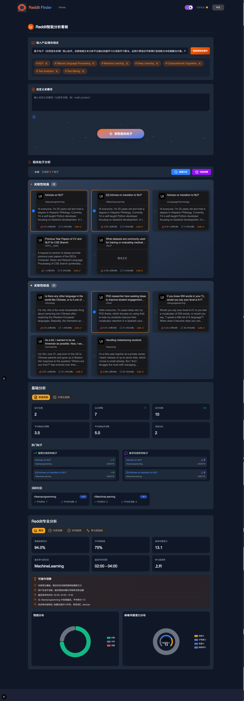
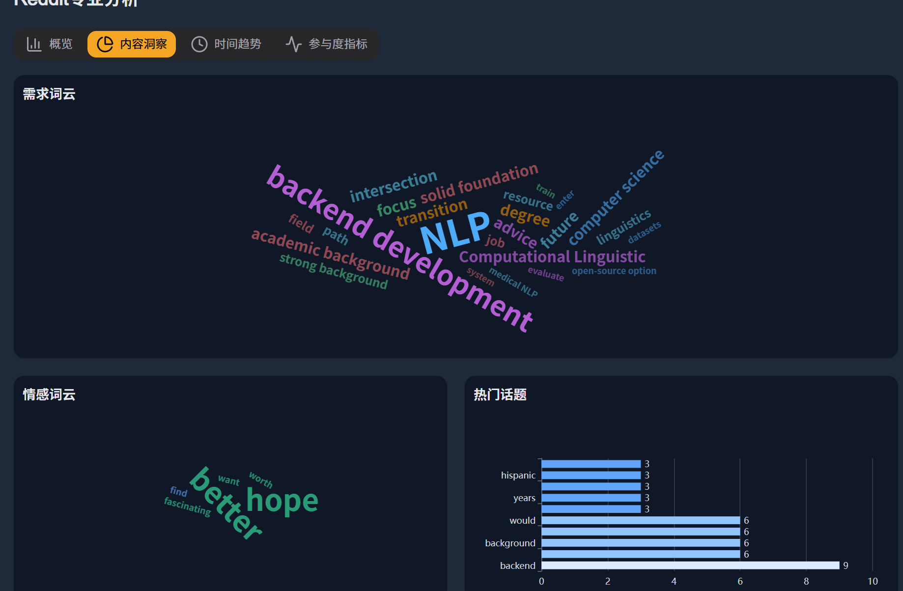
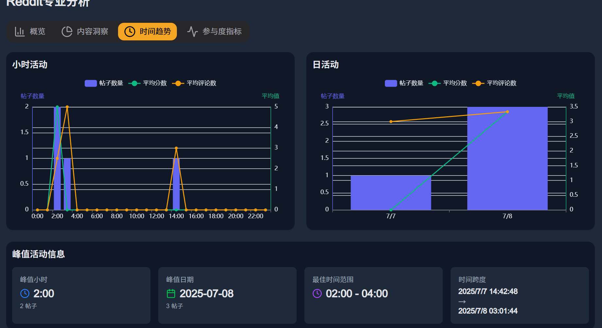

# Reddit Finder Web

## 项目简介
Reddit Finder Web 是一个基于 Reddit 平台的智能分析看板，借助 AI 技术提取关键词，搜索并分析相关帖子，帮助用户快速定位最具价值的帖子，为内容创作、市场调研等提供有力支持。

## 功能特性
1. **关键词智能提取**：输入产品/服务描述，AI 自动提取相关关键词。
2. **帖子搜索**：依据关键词和自定义参数，搜索 Reddit 上的相关帖子。
3. **基础分析**：对选中帖子进行基础数据统计，如总点赞数、总评论数等。
4. **深度分析**：提供更专业的多帖子分析，包括情感分析、热度预测、最佳发布时间等。
5. **数据可视化**：通过多种图表直观展示分析结果，如词云图、趋势图等。

## 技术栈
- **前端框架**：Next.js 13
- **状态管理**：Context API
- **图表库**：ECharts
- **国际化**：next-intl
- **UI 组件库**：@heroui/react
- **动画库**：framer-motion

## 目录结构
```
reddit-finder-web/
├── app/
│   ├── api/                # API 接口相关代码
│   ├── context/            # 全局状态管理
│   ├── [locale]/           # 国际化相关页面
│   └── hero.ts             # Hero 相关配置
├── components/             # 组件目录
│   ├── Common/             # 通用组件
│   ├── Footer/             # 页脚组件
│   ├── Header/             # 页眉组件
│   ├── Hero/               # 首页 Hero 组件
│   ├── RedditDashboard/    # Reddit 分析看板组件
│   │   ├── AnalyzeProfessionalSection/ # 专业分析部分
│   │   │   └── charts/     # 分析图表组件
│   │   ├── PostActions/    # 帖子操作组件
│   │   ├── PostCard/       # 帖子卡片组件
│   │   ├── PostGrid/       # 帖子卡片网格组件
│   │   └── TopSection/     # 看板顶部组件
│   └── ScrollToTop/        # 返回顶部组件
├── hooks/                  # 自定义 Hooks
├── i18n/                   # 国际化配置
│   ├── messages/           # 多语言消息文件
│   ├── routing.ts          # 路由配置
│   └── request.ts          # 请求配置
├── public/                 # 静态资源
├── types/                  # TypeScript 类型定义
├── utils/                  # 工具函数
├── .gitignore              # Git 忽略文件配置
├── next.config.js          # Next.js 配置文件
├── package.json            # 项目依赖和脚本配置
├── postcss.config.js       # PostCSS 配置文件
├── README.md               # 项目说明文档
├── tailwind.config.js      # Tailwind CSS 配置文件
└── tsconfig.json           # TypeScript 配置文件
```
## 安装步骤
1. 克隆仓库到本地
```bash
git clone https://github.com/your-repo/reddit-finder-web.git
cd reddit-finder-web

npm install
# 或使用 yarn
yarn install
# 或 pnpm
pnpm install

# 使用方式
npm run dev
# 或使用 yarn
yarn dev
# 或 pnpm
pnpm dev
# 构建项目
npm run build
# 或使用 yarn
yarn build
# 或 pnpm
pnpm build
```

## 国际化支持
*项目支持多语言，目前已实现的语言包括*

英语（en）
中文（zh-CN）
## 待完善语种
韩语（ko）
俄语（ru）
葡萄牙语（pt）
意大利语（it）
西班牙语（es）
德语（de）
法语（fr）
阿拉伯语（ar）
印地语（hi）
日语（ja）


## 一些问题
注意：
* 项目依赖的 Reddit API 可能存在访问限制，可能需要申请 API 访问权限。
* 在进行专业分析帖子时可能会失败，不要选择太多的帖子进行分析，因为太多的帖子文本量可能会很大，大模型token数量有限，所以需要控制数量。






